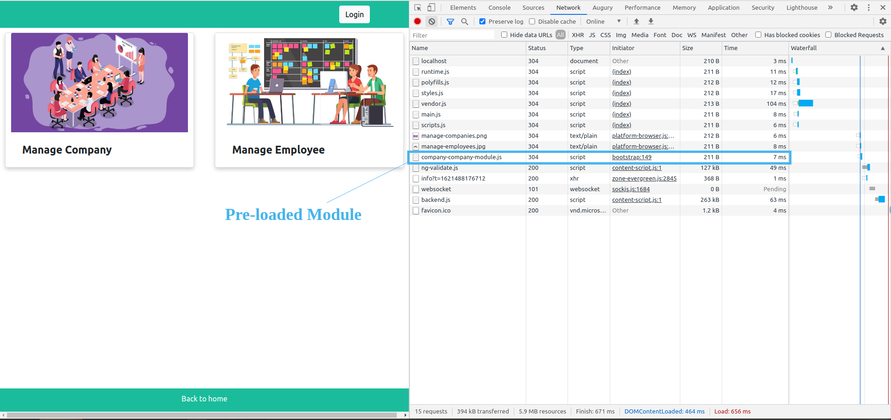

# Angular Multiple Module Example

This is the application for how to manage multiple modules in angular projects.\
A simple way to create multiple modules is to `divide your application into major features` first and create separate modules for each major feature.
Multiple modules are very ***worthwhile*** when you have a massive product to work on. 


### Topics Covered

- Multiple modules
- Defining routes including child routes and lazy-loaded routes
- Custom pre-loading strategy
- Custom pipe
- Auth-guard
- Ngb-Modal


## Steps To Clone It

```
git clone https://github.com/dhruv-rank/angular-9-multiple-module-example.git
cd angular-2-multiple-module-sample-project
npm install
ng serve
```


## Extra Dependency

> bootstrap : "^5.0.1"\
> @ng-bootstrap/ng-bootstrap : "^9.1.1"
 

## Pre Loaded  Module





## Lazy Loaded Module


 


## Purpose Of Every Module

1. Employee Module
    - Employee is the ***major feature*** of this application.

2. Company Module
    - Company is the ***major feature*** of this application.

3. Shared Module
    - Components, directives, and pipes that are `used in multiple different modules` are declared and exported from a shared module.

4. Core Module
    - Modules that are **used in whole application** and services that need **single instance for whole application** are provided in the core module.
    - Core module needs to be imported only once and in the `App module`.
    
5. Login Module
    - I have added login related services and guards into this module(this module is _not mandatory_ for every application)
