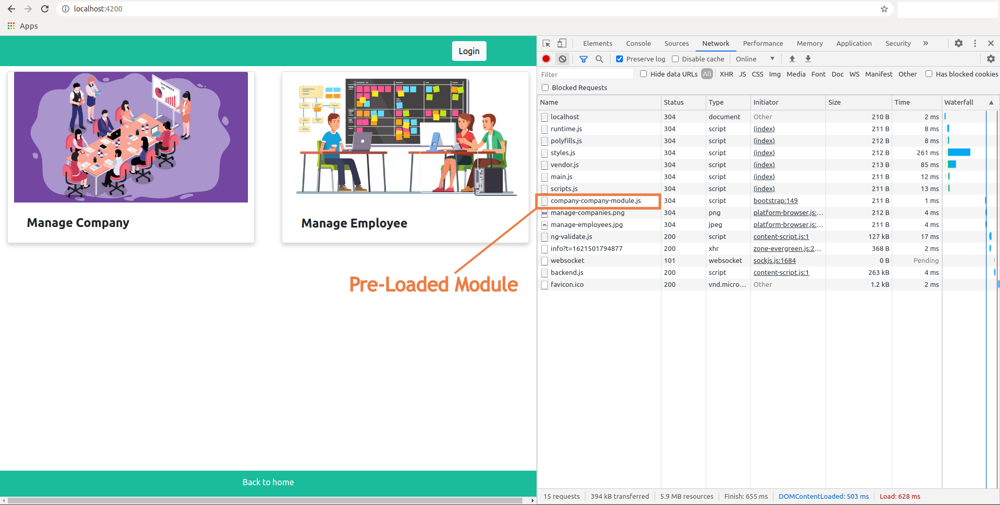
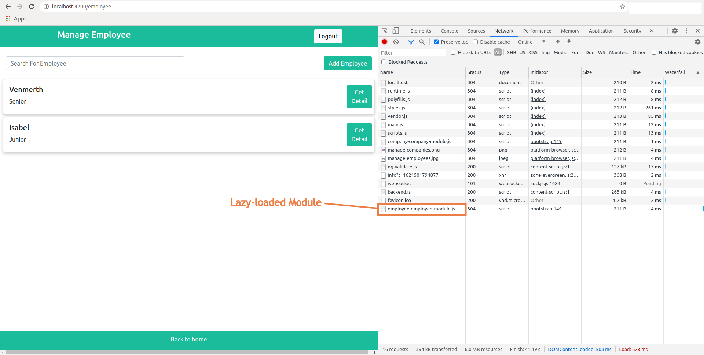

# Angular Multiple Module Example

This is the application for how to manage multiple modules in angular projects.\
A simple way to create multiple modules is to `divide your application into major features` first and create separate modules for each major feature.
Multiple modules are very ***worthwhile*** when you have a massive product to work on. 


### 1. Topics Covered

- Multiple modules
- Custom pre-loading strategy
- Defining routes including child routes and lazy-loaded routes
- Custom pipe
- Auth-guard
- Ngb-Modal

### 1.1. Purpose Of Every Module

1. Employee Module
    - Employee is the ***major feature*** of this application.

2. Company Module
    - Company is the ***major feature*** of this application.

3. Shared Module
    - Components, directives, and pipes that are `used in multiple different modules` are declared and exported from a shared module.

4. Core Module
    - Modules that are **used in whole application** and services that need **single instance for whole application** are provided in the core module.
    - Core module needs to be imported only once and in the `App module`.
    
5. Login Module
    - I have added login related services and guards into this module(this module is _not mandatory_ for every application)


### 1.2. Different Loading Strategy

We have used three kinds of loading strategy in this application
1. Eager Loading
2. Lazy Loading
3. Pre Loading

#### 1.2.1 Eager Loaded Module

- Feature modules under Eager Loading would be loaded before the application starts.
  - Shared Module
  - Core Module
  - Login Module
  - Home Module


#### 1.2.2 Pre Loaded Module

- Feature Modules under Pre-Loading would be loaded automatically after the application starts. It is based on the custom strategy we have created.
  - Company Module
- Custom pre-loading starategy : 
```js
@Injectable()
export class CustomLoadModuleStrategyService implements PreloadingStrategy {

  constructor() { }

  preload(route: Route, fn: () => Observable<any>): Observable<any> {
    if (route['path'] == 'company') {
      return fn();         //return obaservable function if want to preload
    } else {
      return of(null);    //return observable of null if don't want to preload
    }
  }
}
```
- Add custom strategy to `preloadingStrategy` of routes in `AppRoutingModule` :
```js
RouterModule.forRoot(routes, { preloadingStrategy: CustomLoadModuleStrategyService })
```




#### 1.2.3 Lazy Loaded Module

- Feature modules under Lazy Loading would be loaded on-demand after the application starts. It helps to start the application faster.
  - Employee Module

 


### 2 Steps To Clone It

```
git clone https://github.com/dhruv-rank/angular-9-multiple-module-example.git
cd angular-2-multiple-module-sample-project
npm install
```

#### 2.1 To Run On Local-Server :
```
ng serve
```
And start with http://localhost:4200


### 3. Extra Dependency

> bootstrap : "^5.0.1"\
> @ng-bootstrap/ng-bootstrap : "^9.1.1"
 
### 4 Production Build :

Command to build an application for **production** :

```
ng build --prod --aot=true --build-optimizer=true
```
- --prod flag is added to use production environment profile at build time.  
- The Angular '**aot**' compiler converts your Angular HTML and TypeScript code into efficient JavaScript code during the build phase before the browser downloads and runs that code. Compiling your application during the build process provides a faster rendering in the browser.
- The build-optimizer makes it easier for code minifiers to remove unused code by removing Angular-specific decorators, constructor parameters.
